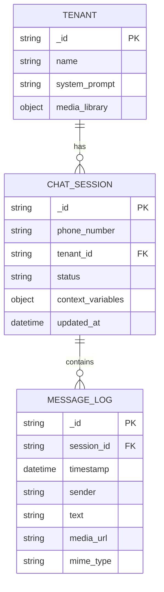
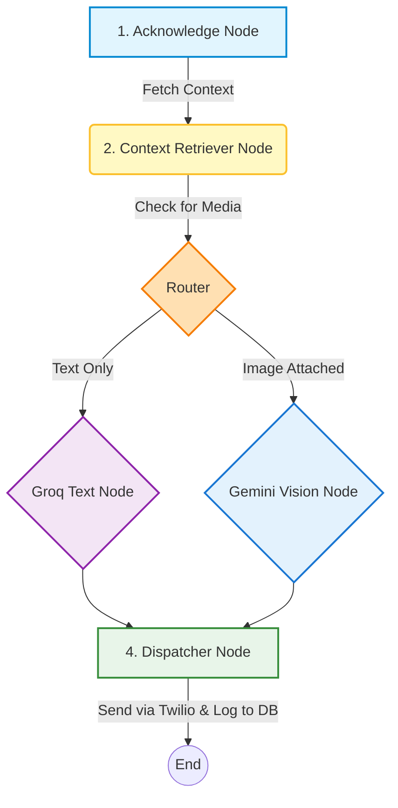

# Multi-Tenant Agentic WhatsApp Orchestrator

This project is a powerful, multi-tenant WhatsApp bot orchestrator built with FastAPI, LangGraph, MongoDB, and a React frontend. It allows you to manage multiple distinct businesses (tenants), each with their own AI system prompt and media library, all sharing a single WhatsApp integration.

## 🚀 Prerequisites
- **Python 3.9+**
- **Node.js (v18+)**
- **MongoDB Atlas** account (or local MongoDB)
- **Twilio** Account (for WhatsApp Sandbox)
- API Keys for **Google Gemini** and **Groq**

## 📂 Repository Structure
- `/backend`: The FastAPI application, LangGraph agent logic, MongoDB integration, and Twilio webhook logic.
- `/frontend`: The React (Vite + Tailwind) dashboard for managing workspaces (tenants) and monitoring live chats.

## Phase 1 Instructions: Setting up MongoDB Atlas

I use **MongoDB Atlas**, which is a fully managed cloud database. I use **MongoDB Compass** (a desktop GUI for MongoDB). I already have an account, so I will skip the first step.

### Step 1: Create a Free MongoDB Atlas Cluster
1. Go to [MongoDB Atlas](https://www.mongodb.com/cloud/atlas/register) and create a free account.
2. Deploy a new database. Choose the **M0 Free Tier**.
3. Select your preferred cloud provider and region (any works fine) and click **Create**.

### Step 2: Configure Database Access
1. Under **Security > Database Access** in the left sidebar, add a new database user.
2. Choose a username and a strong password. **Save these credentials**, you will need them.
3. Under **Security > Network Access**, click **Add IP Address** and choose **Allow Access From Anywhere** (0.0.0.0/0) so your local machine can connect to it.

### Step 3: Get your Connection String
1. Go to **Database** (under Deployment) and click the **Connect** button on your cluster.
2. Select **Compass** to connect using MongoDB Compass.
3. Copy the connection string provided. It will look like this:
   `mongodb+srv://<username>:<password>@cluster0.mongodb.net/test`
4. Replace `<username>` and `<password>` with the credentials you created in Step 2.

### Step 4: Connect using MongoDB Compass
1. Open your locally installed **MongoDB Compass**.
2. Paste the connection string into the URI field and click **Connect**.
3. You are now connected! We will use this connection string in our `.env` file later for the backend to connect.


## Phase 2: Database Schema & Access Layer
The database access layer uses PyMongo and Pydantic for schema validation. Below is the multi-tenant architecture designed to manage multiple businesses and their chat histories.
### Database Entities
1. **Tenant**: Represents the business (e.g., Luxury Furniture, Automotive Care). It holds the system prompt instructing the AI how to act, and the `media_library` containing URLs for rich media assets (PDFs, images) that the agent can send.
2. **Chat Session**: Represents an active or past conversation linked to a user's phone number. It tracks the current status of the conversation (e.g., `WAITING_FOR_BOT`, `AGENT_RESPONDING`) and dynamically stores context variables parsed by the AI.
3. **Message Log**: Stores the individual inbound and outbound messages. It acts as an audit trail, saving timestamps, sender info (user vs. bot), raw text, and any media URLs attached to the message.
### Schema Diagram


## Architectural Decisions & Limitations

### Why Twilio instead of the Official Meta API?
Initially, this project targeted the official Meta WhatsApp Cloud API. However, Meta enforces strict onboarding requirements: new developer accounts are subjected to a mandatory 1-hour "cooling off" period before they can create business apps, and going live requires comprehensive business verification.
To accelerate development and allow for instant testing without bureaucratic hurdles, we chose the **Twilio WhatsApp Sandbox**, which allows developers to test WhatsApp integrations immediately.

### Why no "Typing..." indicators or "Read" receipts?
Twilio's API abstracts WhatsApp to behave like a standard programmable messaging channel (similar to SMS). Because of this abstraction, the Twilio API does **not** natively expose WhatsApp-specific UI events, such as manually triggering a "typing..." indicator or a "read" receipt via a webhook response.

### Our Solution to the Perception of Delay
Because AI processing (especially multimodal reasoning with Gemini or Groq) can take several seconds, the lack of a "typing..." indicator could make the user think the bot is ignoring them. 
To solve this, our LangGraph orchestration uses an **Acknowledge Node** that instantly fires a generic text message (e.g., *"Just a moment..."*) the millisecond the webhook is received. This provides immediate feedback to the user, assuring them that their request is actively being processed, effectively replacing the need for a native typing indicator.

## Phase 3: Twilio WhatsApp Sandbox Setup

We use Twilio's WhatsApp Sandbox for easy testing and development without needing Meta business verification.

### Step 1: Install Ngrok
Ngrok is a tool that exposes your local server to the internet so Twilio can send webhooks to it.
1. Open your Mac Terminal.
2. If you have Homebrew installed, simply run:
   ```bash
   brew install ngrok/ngrok/ngrok
   ```
   *(Alternatively, download it from [ngrok.com/download](https://ngrok.com/download) and follow the Mac instructions).*
3. Create a free account on ngrok.com, get your authtoken from your dashboard, and run:
   ```bash
   ngrok config add-authtoken <your-token>
   ```

### Step 2: Start the Backend Server and Ngrok
1. Open a terminal, activate your virtual environment, and start the FastAPI server:
   ```bash
   cd backend
   source venv/bin/activate
   pip install -r requirements.txt
   uvicorn main:app --reload
   ```
2. Open a *second* terminal and start Ngrok on port 8000:
   ```bash
   ngrok http 8000
   ```
3. Copy the **Forwarding URL** provided by Ngrok (it looks like `https://abcd-123.ngrok-free.app`). Leave both terminals running.

### Step 3: Configure Twilio Sandbox
1. Create a free account at [Twilio](https://www.twilio.com/).
2. Go to **Messaging > Try it out > Send a WhatsApp message**.
3. Follow the instructions to connect your personal WhatsApp number to the Sandbox by sending the join code.
4. Go to **Sandbox settings**.
5. In the "When a message comes in" field, paste your Ngrok URL and append `/webhook` (e.g., `https://abcd-123.ngrok-free.app/webhook`). Save the settings.

### Step 4: Update `.env` file
Copy your Twilio credentials from the main Twilio Console dashboard to your `backend/.env` file:
```env
TWILIO_ACCOUNT_SID=your_account_sid
TWILIO_AUTH_TOKEN=your_auth_token
TWILIO_WHATSAPP_NUMBER=whatsapp:+14155238886
GOOGLE_API_KEY=your_gemini_api_key
GROQ_API_KEY=your_groq_api_key
```

### Step 5: Send a Test Message!
1. Send a WhatsApp message to the Twilio Sandbox number. You can even send an image!
2. Look at your FastAPI terminal logs. You should see your message arrive and the LangGraph agent processing it!
3. You should immediately receive a reply text back from the bot.

## Phase 4: LangGraph Agent Orchestration

We have implemented a powerful hybrid AI workflow using **LangGraph**, **Groq** (`llama-3.3-70b-versatile`) for ultra-fast text reasoning, and **Google Gemini** (`gemini-3.5-flash`) for multimodal vision tasks. 

The pipeline consists of 5 nodes:
1. **Acknowledge Node**: Receives the incoming webhook and parses the payload.
2. **Context Retriever Node**: Connects to MongoDB to pull the Tenant's specific system prompt, media library, and the user's past chat history.
3. **Router**: Checks if the user attached an image or PDF.
4. **LLM Reasoning Nodes**:
   - **Groq Node**: Processes plain text messages instantly.
   - **Gemini Vision Node**: Analyzes incoming images and performs visual searches against the media library.
   *(Both nodes use function calling to determine if the user requires a plain text response or a specific media file).*
5. **Dispatcher Node**: Dispatches the final text or media payload back to the user via the Twilio API and saves the bot's response to the MongoDB Message Log.

### Agent Workflow Diagram


## Phase 5: Frontend Dashboard & Workspace Management

To manage multiple clients (tenants) without writing code, we built a modern React dashboard using **Vite**, **Tailwind CSS**, and **Lucide Icons**.

### Key Features:
1. **Dynamic Workspace Creation**: Easily add new "Tenants" via an interactive UI. You can define the business name, the core AI system prompt, and optionally upload a document (like a PDF catalog) that the agent can send to users.
2. **Real-time Monitoring**: The dashboard constantly polls the backend to display live WhatsApp conversations for any selected workspace.
3. **Media Link Resolution**: The dashboard gracefully handles media attachments. Any document uploaded by the workspace admin or sent by the customer is directly viewable in the chat thread.

### Running the Frontend Locally:
1. Navigate to the frontend directory:
   ```bash
   cd frontend
   npm install
   npm run dev
   ```
2. Ensure your backend is running (`uvicorn main:app --reload --port 8000`) so the frontend can pull the live tenant and session data.

## Phase 6: Production Deployment

### 1. Deploying the Backend (Google Cloud Run)
We use **Google Cloud Run** to host the FastAPI backend because it is serverless and scales automatically.

1. Install the Google Cloud CLI (`gcloud`).
2. Run the deployment command from the `backend` folder:
   ```bash
   gcloud run deploy krid-backend --source . --region us-central1 --allow-unauthenticated
   ```
3. **CRITICAL: Environment Variables**: You must manually add your `.env` variables (MongoDB URI, Groq/Google API keys, Twilio credentials) inside the Google Cloud Console under the **Variables & Secrets** tab for your Cloud Run service. The backend will crash without them!
4. *Note on File Storage*: Because Cloud Run is stateless, any PDFs uploaded via the frontend Dashboard to the `/uploads` folder will only exist temporarily while the server is awake. For a permanent production solution, you should attach an external storage bucket (like Google Cloud Storage).

### 2. Deploying the Frontend (Firebase Hosting)
The React frontend is hosted on **Firebase Hosting** for lightning-fast global delivery.

1. Ensure `API_BASE` in `App.jsx` points to your live Cloud Run URL (e.g. `https://krid-backend-.../api`).
2. Build the production files:
   ```bash
   npm run build
   ```
3. Deploy to Firebase:
   ```bash
   firebase deploy --only hosting
   ```
4. *Important*: Always remember to run `npm run build` *before* deploying if you make any changes to the code!
